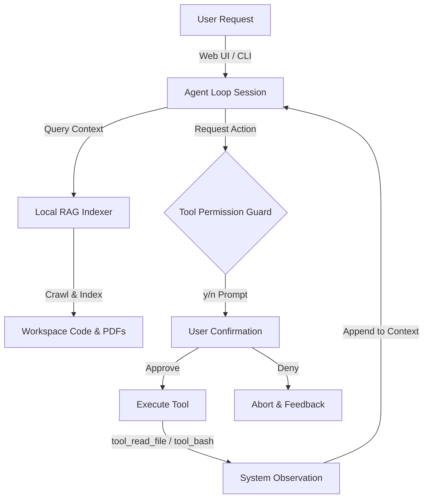

# Odysseus Lite

**Odysseus Lite** is a secure, fully offline local AI workspace co-pilot. Built to run on consumer hardware (under 4GB VRAM) using Ollama, it implements a highly resilient ReAct execution loop, codebase RAG grounding, and sandboxed interactive permission gates.

It features both a **Command Line Interface (CLI)** and a sleek, glassmorphic **One Dark web dashboard** that streams live thoughts and execution logs in real-time.

---

## Example Use Cases

Here are general examples of tasks you can assign to Odysseus Lite:

### 1. Codebase Refactoring and Analysis
*   **Prompt:** "Search the codebase for all functions matching connect_db. Replace them with the new pool-based get_db_connection function in database.py, and run the python tests to ensure nothing broke."
*   **Agent Path:** The agent will use `tool_workspace_rag` to locate the definitions, read the target files, modify them, and run the test suite via the bash tool.

### 2. Interactive Document Ingestion and Synthesis
*   **Prompt:** "Search the workspace for the PDF document called metrics_report.pdf, read its contents, and compile a summary of the latency metrics to metrics_summary.md."
*   **Agent Path:** The agent will query the index, extract text from the binary PDF pages, and write the compiled markdown report.

### 3. Automated Error Diagnostics and Healing
*   **Prompt:** "Execute python test_model.py. If there are any failing tests, check the source file of the failing modules, apply the fix, and re-run to confirm."
*   **Agent Path:** The agent runs the script, captures the traceback, reads the buggy files, writes the patch, and re-runs to verify.

### 4. Developer Onboarding and Architecture Research
*   **Prompt:** "Search the workspace to find how the LLM model configurations and context windows are initialized and write an architectural notes file."
*   **Agent Path:** The agent queries RAG for config variables, traces initialization in the code, and compiles the notes.

---

## Key Features

*   **Offline First (100% Private):** Runs entirely locally using lightweight models (e.g., `qwen2.5-coder:3b-instruct` or `granite4.1:3b`) via Ollama. No data ever leaves your machine.
*   **Dual-Interface Control:**
    *   **CLI Mode:** Run commands directly in your terminal with positional parameters and workspace target flags.
    *   **Web Dashboard:** A premium, glassmorphic UI streaming live agent outputs (Thoughts, Actions, and Observations) via Server-Sent Events (SSE).
*   **Interactive Security Permission Gates:** 
    *   Prevents rogue AI actions. Before running any shell command (`tool_bash`) or editing/writing files, the system halts and waits for explicit human confirmation.
    *   Terminal prompts require a strict y/n confirmation.
    *   The Web UI displays a red slide-down alert panel overlay requiring click-to-approve confirmation before resuming.
*   **Zero-Dependency Local RAG:** Includes an in-memory TF-IDF / text-overlap indexer that scans and crawls your workspace to feed matching code snippet contexts to the LLM.
*   **PDF Parsing Integration:** Programmatic binary text extraction via `pypdf` which integrates directly into both the direct read tool (`tool_read_file`) and the codebase RAG indexer.
*   **Hang-Protection (Process Isolation):** All shell commands are sandboxed with a strict 15-second execution timeout to prevent infinite loops, blocking commands, or terminal freeze.

---

## Core System Architecture



---

## Cross-Platform Compatibility (Windows & Linux)

Yes! Odysseus Lite is fully cross-platform and runs out-of-the-box on Windows, Linux, and macOS:
*   **Pathing:** File operations automatically normalize path separators (`\` on Windows, `/` on Linux) to prevent sandbox escapes.
*   **Shell Commands (tool_bash):** When executing terminal commands:
    *   On **Linux/macOS**, commands run in the standard system shell (`/bin/sh` or `/bin/bash`).
    *   On **Windows**, commands execute in the native Command Prompt (`cmd.exe`). If the agent tries to run Linux-specific commands (like `ls` or `grep`), they may fail unless you run the server inside **WSL (Windows Subsystem for Linux)** or have Git Bash commands added to your system PATH.

---

## Setup & Installation Guide

### Step 1: Install Ollama (Local LLM Engine)

Select the command/installer for your Operating System:

*   **Windows:**
    1. Download the Windows installer from [Ollama's Official Website](https://ollama.com/download/windows).
    2. Run the `.exe` installer.
    3. Open PowerShell or Command Prompt and run:
       ```bash
       ollama pull qwen2.5-coder:3b-instruct
       ```

*   **Linux:**
    1. Open your terminal and run the official install script:
       ```bash
       curl -fsSL https://ollama.com/install.sh | sh
       ```
    2. Start the service (if not auto-started) and pull the model:
       ```bash
       ollama pull qwen2.5-coder:3b-instruct
       ```

*   **macOS:**
    1. Download the macOS zip from [Ollama's Official Website](https://ollama.com/download/mac).
    2. Unzip, move `Ollama.app` to your Applications folder, and launch it.
    3. Open Terminal and run:
       ```bash
       ollama pull qwen2.5-coder:3b-instruct
       ```

---

### Step 2: Setup Python & Requirements

1.  **Clone the Repository:**
    ```bash
    git clone https://github.com/your-username/odysseus-lite.git
    cd odysseus-lite
    ```

2.  **Initialize Virtual Environment:**
    *   **Linux / macOS:**
        ```bash
        python3 -m venv .venv
        source .venv/bin/activate
        ```
    *   **Windows (PowerShell):**
        ```powershell
        python -m venv .venv
        .venv\Scripts\Activate.ps1
        ```
    *   **Windows (Command Prompt - cmd.exe):**
        ```cmd
        python -m venv .venv
        .venv\Scripts\activate.bat
        ```

3.  **Install Requirements:**
    ```bash
    pip install -r requirements.txt
    ```

---

## How to Use

### Run via Web Dashboard
Start the local server daemon:
```bash
python app_ui.py
```
Open your browser and navigate to: **`http://127.0.0.1:5000`**

1.  Enter your target **Workspace Path** in the sidebar.
2.  Type your coding or research goal.
3.  Click **Initialize Agent**.
4.  Monitor execution logs and click **Approve** or **Deny** on the top overlay warning when the agent requests permissions.

---

### Run via Command Line (CLI)
You can target any workspace directory on your machine using the `-w` or `--workspace` flag:
```bash
python ody.py "Search the codebase for database helpers and write a summary to notes.txt" -w /absolute/path/to/project
```
The terminal will halt and prompt you: `Approve? (y/n):` before executing commands or saving file updates.

---

## Safety Sandboxing Guidelines

*   **Timeout Containment:** Any shell command executed via `tool_bash` that runs longer than 15 seconds is forcibly terminated (`SIGKILL`), releasing the thread.
*   **Path Traversal Protection:** Absolute path checking prevents the agent from reading or writing files outside the targeted workspace (e.g. attempting to read `/etc/passwd` returns a `Permission Denied` error string).
*   **Robust Parser Isolation:** The parser only extracts execution tags from the final `ACTION:` blocks, ensuring that explaining a tool in the `THOUGHT:` section never accidentally triggers a command.
