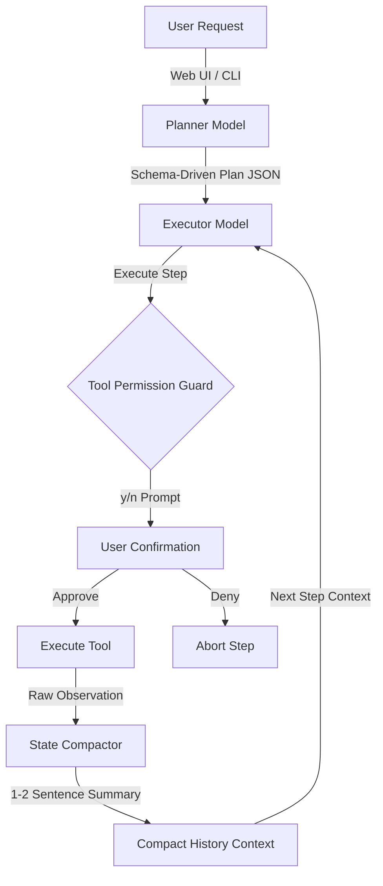

# Odysseus Lite

**Odysseus Lite** is a secure, fully offline local AI workspace co-pilot. Built to run on consumer hardware (under 4GB VRAM) using Ollama, it implements a highly resilient dual-model **Planner-Executor split**, codebase RAG grounding, observation state compaction, and sandboxed interactive permission gates.

It features both a **Command Line Interface (CLI)** and a sleek, glassmorphic **One Dark web dashboard** that streams live plans, thoughts, and execution logs in real-time.

---

## Example Use Cases

Here are general examples of tasks you can assign to Odysseus Lite:

### 1. Codebase Refactoring and Analysis
*   **Prompt:** "Search the codebase for all functions matching connect_db. Replace them with the new pool-based get_db_connection function in database.py, and run the python tests to ensure nothing broke."
*   **Agent Path:** The agent will use `tool_workspace_rag` to locate the definitions, read the target files, modify them, and run the test suite via the bash tool.

### 2. Interactive Document Ingestion and Synthesis
*   **Prompt:** "Search the workspace for the PDF document called metrics_report.pdf, read its contents, and compile a summary of the latency metrics to metrics_summary.md."
*   **Agent Path:** The agent will query the index, extract text from the binary PDF pages, and write the compiled markdown report.

### 3. Automated Error Diagnostics and Healing
*   **Prompt:** "Execute python test_model.py. If there are any failing tests, check the source file of the failing modules, apply the fix, and re-run to confirm."
*   **Agent Path:** The agent runs the script, captures the traceback, reads the buggy files, writes the patch, and re-runs to verify.

---

## Key Features

*   **Offline First (100% Private):** Runs entirely locally using lightweight models via Ollama. No data ever leaves your machine.
*   **Schema-Driven Planner-Executor Split:** 
    *   Offloads step planning to a robust local model (e.g., `llama3.1:8b` or `deepseek-r1:1.5b`) which generates a tool-constrained step JSON array.
    *   Passes individual atomic steps to a fast executor model (`qwen2.5-coder:3b-instruct` or `granite4.1:3b`) responsible strictly for generating tool parameters. This eliminates cognitive repetition loops.
*   **State Compactor (Memory Optimization):**
    *   Dynamically condenses large tool output payloads (like raw file contents or RAG indexes exceeding 500 characters) into concise 1-2 sentence summaries.
    *   Reduces agent latency by **over 57%** and completely prevents context-window overflow and parsing drift.
*   **Dual-Interface Control:**
    *   **CLI Mode:** Run commands directly in your terminal with custom workspace target, planner model, and executor model flags.
    *   **Web Dashboard:** A premium, glassmorphic UI streaming live agent outputs (Plan, Thoughts, Actions, and Observations) via Server-Sent Events (SSE).
*   **Interactive Security Permission Gates:** 
    *   Prevents rogue AI actions. Before running any shell command (`tool_bash`) or editing/writing files, the system halts and waits for explicit human confirmation.
    *   Terminal prompts require a strict y/n confirmation.
    *   The Web UI displays a red slide-down alert panel overlay requiring click-to-approve confirmation before resuming.
*   **Zero-Dependency Local RAG:** Includes an in-memory indexer that scans and crawls your workspace to feed matching code snippet contexts to the LLM.
*   **PDF Parsing Integration:** Programmatic binary text extraction via `pypdf` which integrates directly into both the read tool and the RAG indexer.
*   **Hang-Protection (Process Isolation):** All shell commands are sandboxed with a strict 15-second execution timeout to prevent infinite loops or terminal freeze.

---

## Core System Architecture



---

## Setup & Installation Guide

### Step 1: Install Ollama (Local LLM Engine)

Select the command/installer for your Operating System:

*   **Windows:**
    1. Download the Windows installer from [Ollama's Official Website](https://ollama.com/download/windows).
    2. Run the `.exe` installer.
    3. Open PowerShell and pull the recommended Planner and Executor models:
       ```bash
       ollama pull llama3.1:8b
       ollama pull qwen2.5-coder:3b-instruct
       ```

*   **Linux:**
    1. Open terminal and run:
       ```bash
       curl -fsSL https://ollama.com/install.sh | sh
       ```
    2. Start the service and pull the models:
       ```bash
       ollama pull llama3.1:8b
       ollama pull qwen2.5-coder:3b-instruct
       ```

*   **macOS:**
    1. Download the macOS zip from [Ollama's Official Website](https://ollama.com/download/mac).
    2. Unzip, move `Ollama.app` to your Applications folder, and pull models:
       ```bash
       ollama pull llama3.1:8b
       ollama pull qwen2.5-coder:3b-instruct
       ```

---

### Step 2: Setup Python & Requirements

1.  **Clone the Repository:**
    ```bash
    git clone https://github.com/ichhabalsingh/odysseus-lite.git
    cd odysseus-lite
    ```

2.  **Initialize Virtual Environment:**
    *   **Linux / macOS:**
        ```bash
        python3 -m venv .venv
        source .venv/bin/activate
        ```
    *   **Windows (PowerShell):**
        ```powershell
        python -m venv .venv
        .venv\Scripts\Activate.ps1
        ```

3.  **Install Requirements:**
    ```bash
    pip install -r requirements.txt
    ```

---

## How to Use

### Run via Web Dashboard
Start the local server daemon:
```bash
python app_ui.py
```
Open your browser and navigate to: **`http://127.0.0.1:5000`**

1.  Enter your target **Workspace Path** in the Control Center.
2.  Choose your **Executor Model** and **Planner Model** from the dropdown selectors.
3.  Type your coding or research goal.
4.  Click **Initialize Agent**.
5.  Monitor execution logs and click **Approve** or **Deny** on the top alert panel when the agent requests permissions.

---

### Run via Command Line (CLI)
You can target any workspace directory on your machine using the CLI and customize the models:
```bash
python ody.py "Search codebase for categories and write to notes.txt" -w /path/to/project -p llama3.1:8b -e qwen2.5-coder:3b-instruct
```

#### CLI Parameters:
*   `-w`, `--workspace`: Path to the workspace directory to scan and work in (defaults to current working directory).
*   `-p`, `--planner`: Local model to use for step planning (defaults to `llama3.1:8b`).
*   `-e`, `--executor`: Local model to use for step execution (defaults to `qwen2.5-coder:3b-instruct`).

The terminal will halt and prompt you: `Approve? (y/n):` before executing commands or saving file updates.

---

## Safety Sandboxing Guidelines

*   **Timeout Containment:** Any shell command executed via `tool_bash` that runs longer than 15 seconds is forcibly terminated (`SIGKILL`), releasing the thread.
*   **Path Traversal Protection:** Absolute path checks prevent the agent from reading or writing files outside the targeted workspace (e.g. attempting to read `/etc/passwd` returns a `Permission Denied` error string).
*   **Robust Parser Isolation:** The parser only extracts execution tags from final `ACTION:` blocks, ensuring that explaining a tool in the `THOUGHT:` section never accidentally triggers a command.
